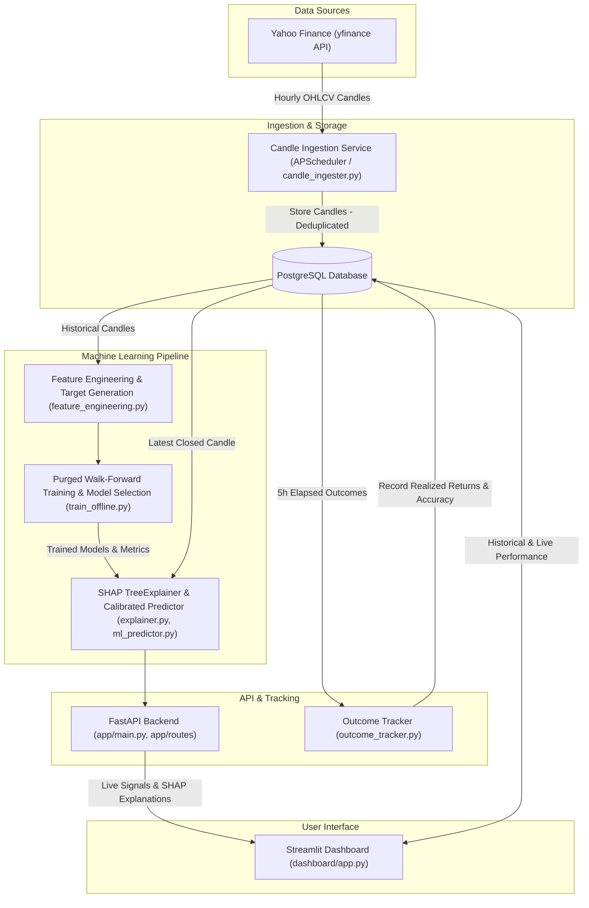

# MarketLens: Explainable Market Trend Forecasting with Live Performance Tracking

An end-to-end machine learning system that forecasts short-term market trends for crypto and equity assets using hourly price data. It serves calibrated predictions via a FastAPI backend, explains model decisions in plain English with SHAP values, and tracks real-world accuracy over time in an interactive Streamlit dashboard.

---

## What It Does

This platform continuously collects hourly market data for **Bitcoin (BITCOIN)**, **Ethereum (ETHEREUM)**, and **IBM (IBM)**. For each asset, it predicts one of three directional outcomes over the next 5 hours:
* **UP**: Maximum forward gain reaches at least +0.5% and dominates downward movement.
* **DOWN**: Maximum forward decline reaches at least -0.5% and dominates upward movement.
* **NEUTRAL**: Price movement stays within ±0.5% over the 5-hour window.

Along with each prediction, the system outputs a calibrated confidence score, translates feature contributions into plain-English reasoning (such as recent volatility or momentum), and systematically records and verifies every prediction against actual future market prices once the 5-hour window closes.

---

## Visual Previews


---

## Architecture

The system operates as a modular, containerized data and prediction pipeline:



---

## Tech Stack

Derived directly from [`requirements.txt`](requirements.txt) and [`Dockerfile`](Dockerfile):

* **Language & Runtime:** Python 3.11 (tested on Python 3.11.17 in container, compatible with Python 3.11+), Docker, Docker Compose
* **Backend API & Scheduling:** FastAPI (==0.142.2), Uvicorn (==0.54.0), APScheduler (==3.11.3), Pydantic
* **Database & Storage:** PostgreSQL 15, psycopg2-binary (==2.9.13)
* **Machine Learning & Analytics:** scikit-learn (==1.9.1), XGBoost (==3.2.0), LightGBM (==4.7.0), SHAP (==0.51.0), joblib (==1.6.0), NumPy (==2.4.6), pandas (==3.0.6)
* **Interactive Frontend:** Streamlit (==1.65.0), Matplotlib (==3.11.2), Seaborn (==0.13.2)
* **Market Data & Testing:** yfinance (==1.7.0), requests (==2.34.2), pytest (==9.1.1)

---

## How to Run

### 1. Configure Environment Variables
Copy the example environment configuration and supply a database password:
```bash
cp .env.example .env
```
Edit `.env` to ensure `DB_PASSWORD` is configured.

### 2. Launch Services with Docker Compose
Start PostgreSQL, the FastAPI backend, and the Streamlit dashboard in detached mode:
```bash
docker compose up --build -d
```
Verify all three containers are healthy:
```bash
docker compose ps
```

### 3. Initialize Database Tables
Create database tables and required unique indexes:
```bash
docker compose exec api python scripts/init_db.py
```

### 4. Ingest Initial Data & Train Models (Optional)
To backfill candles and train the walk-forward models offline:
```bash
# Ingest historical candles
docker compose exec api python scripts/run_ingestion.py

# Train models using purged walk-forward cross-validation
docker compose exec api python ml/train_offline.py
```
*(Pre-trained models are already included in [`ml/models/`](ml/models/) so you can run predictions immediately.)*

### 5. Access Interfaces
* **Streamlit Dashboard:** [http://localhost:8501](http://localhost:8501)
* **FastAPI Swagger Documentation:** [http://localhost:8000/docs](http://localhost:8000/docs)
* **FastAPI Liveness Health Check:** [http://localhost:8000/health](http://localhost:8000/health)

---

## Results (Honest)

The metrics below are taken directly from [`ml/models/metrics.json`](ml/models/metrics.json) and [`ml/models/backtest.json`](ml/models/backtest.json), evaluated across 5 purged walk-forward folds. Strategy and Buy-and-Hold returns are computed from backtest equity multiples as $(\text{multiple} - 1) \times 100$:

| Asset | Served Model | Model MCC (95% CI) | Best Baseline MCC (95% CI) | Strategy Return | Buy-and-Hold Return | Best Baseline Return | Sharpe | Max Drawdown (Strategy vs B&H) | Trades |
| :--- | :--- | :--- | :--- | :--- | :--- | :--- | :--- | :--- | :--- |
| **BITCOIN** | RandomForest | **0.1067** [0.0801, 0.1317] | 0.0692 [0.0500, 0.0874] *(Momentum)* | -34.83% *(0.6517x)* | -19.26% *(0.8074x)* | **-6.48%** *(0.9352x, Mom)* | -1.61 | -39.58% vs -53.72% | 544 |
| **ETHEREUM** | RandomForest | **0.0732** [0.0454, 0.1001] | 0.0517 [0.0328, 0.0697] *(Momentum)* | -65.40% *(0.3460x)* | **-14.57%** *(0.8543x)* | -46.11% *(0.5389x, Mom)* | -2.03 | -73.85% vs -69.16% | 587 |
| **IBM** | RandomForest | 0.0419 [0.0094, 0.0743] | **0.0610** [0.0256, 0.0992] *(Majority)* | -39.92% *(0.6008x)* | **+35.60%** *(1.3560x)* | +2.66% *(1.0266x, Maj)* | -1.70 | -45.20% vs -37.89% | 605 |

### Key Findings
1. **Statistically Significant Edge on Bitcoin:** The Bitcoin model achieves $MCC = 0.1067$, with the 95% bootstrap confidence interval $[0.0801, 0.1317]$ strictly higher than the momentum baseline ($MCC = 0.0692$).
2. **Inconclusive on Ethereum:** While Ethereum achieves an MCC of $0.0732$, its confidence interval $[0.0454, 0.1001]$ overlaps with baseline momentum variation ($0.0517$ $[0.0328, 0.0697]$), indicating marginal predictive power.
3. **No Proven Edge on IBM:** The served model ($MCC = 0.0419$) is outperformed by the simple majority-class baseline ($MCC = 0.0610$).
4. **Every Active Strategy Lost Money After Fees:** When accounting for realistic transaction friction (0.10% round-trip fee), every active ML model lost money (-34.83% on Bitcoin, -65.40% on Ethereum, and -39.92% on IBM) with negative Sharpe ratios across the board (-1.61, -2.03, and -1.70). High trade counts (544–605 trades) resulted in fees eroding capital.
5. **Asset Performance Context:** Over this ~8-month backtest period, buy-and-hold also lost money on Bitcoin (-19.26%) and Ethereum (-14.57%). Only IBM buy-and-hold was profitable (+35.60%). While active trading reduced maximum drawdown on Bitcoin (-39.58% vs -53.72%), passive buy-and-hold outperformed the active ML strategy across all three assets.

---

## How It Is Evaluated

Every evaluation claim matches the pipeline implementation in [`ml/train_offline.py`](ml/train_offline.py):

* **Purged Walk-Forward Validation:** Evaluated using 5 chronological expanding-window folds (`TimeSeriesSplit(n_splits=5)`, lines 110, 343). A 5-bar embargo (`HORIZON = 5`, lines 103, 353) is purged from the end of each training split to prevent overlap with the forward look-ahead target.
* **Moving-Block Bootstrap Confidence Intervals:** 95% empirical confidence intervals for MCC and Balanced Accuracy are calculated across 1,000 bootstrap iterations with a **10-bar block length** (`block_length = 2 * HORIZON = 10 bars`, lines 166, 187–191) to preserve serial autocorrelation.
* **Realistic Baselines:**
  - `Always UP`: Predicts class 2 (UP) on all bars (line 405).
  - `Majority Class`: Predicts the training fold's historical majority class (lines 407–410).
  - `Momentum Heuristic`: Evaluates the preceding 1-hour bar return (`ret_1`): predicts UP if `ret_1 > +0.5%`, DOWN if `ret_1 < -0.5%`, and NEUTRAL otherwise (lines 415–420).
* **Long-Only Fee-Aware Backtest:** The backtest simulates a strictly **long-only** policy (`signal = (preds[:-1] == 2).astype(int)`, line 276), entering long when predicting UP and holding cash when predicting NEUTRAL or DOWN. Transaction costs apply a **0.10% (10 bps) round-trip fee** (`FEE_ROUNDTRIP = 0.001`, lines 111, 284–288), split into 0.05% upon entry and 0.05% upon exit.
* **Isotonic Probability Calibration:** The highest-MCC model is calibrated on the full dataset using `CalibratedClassifierCV(estimator=..., method="isotonic", cv=5)` (lines 518–524). In production inference ([`app/services/ml_predictor.py#L164-L170`](app/services/ml_predictor.py)), `predict_proba()` produces these isotonic calibrated probabilities for directional classification and threshold gating (`SIGNAL_THRESHOLD = 0.40`).
* **Live Outcome Tracking:** A background scheduler periodically queries subsequent market prices once 5 hours elapse, recording true outcomes and tracking live prediction accuracy in PostgreSQL ([`app/services/outcome_tracker.py#L32-L144`](app/services/outcome_tracker.py)).

---

## Limitations

1. **Sample History:** Ingestion and walk-forward evaluation cover ~4,200 to 4,700 hourly test candles per asset (~6.5 months of 24/7 crypto data, ~26 months of US equity trading hours).
2. **Price-Only Features:** Features are derived solely from OHLCV candles across 14 technical indicators: multi-period returns (1h, 3h, 5h, 10h), lagged returns (t-1, t-2, t-3, t-5), rolling volatility (10h), RSI (14h), MACD histogram, price relative to moving averages (MA5, MA10, MA20), and log volume change. Order book depth, funding rates, sentiment, and macro indicators are not included.
3. **Model Selection Overlap:** The served model was selected on the same walk-forward validation splits it was evaluated on.
4. **Single Asset Edge:** Only Bitcoin demonstrates a statistically defensible classification edge over baselines.
5. **Live Sample Size:** Live outcome tracking metrics require multiple weeks of live operation before statistical significance can be established.
6. **Confidence Values Interpretation:** Confidence values are model probabilities, not measured hit rates; see the live performance section for observed accuracy.
7. **Not Financial Advice:** This software is an engineering demonstration of predictive ML pipelines and is not intended for live capital allocation.

---

## Project Structure

```
├── Dockerfile                  # Multi-target build (FastAPI API and Streamlit Dashboard)
├── docker-compose.yml          # Container orchestration (postgres, api, dashboard)
├── requirements.txt            # Python dependencies (pinned versions)
├── pytest.ini                  # Pytest configuration
├── schema.sql                  # PostgreSQL database DDL
├── LICENSE                     # MIT License
├── .env.example                # Template for environment configuration
│
├── app/
│   ├── main.py                 # FastAPI application entrypoint & lifecycle
│   ├── config.py               # Settings and environment loader
│   ├── database.py             # PostgreSQL connection pooling
│   ├── scheduler.py            # APScheduler cron jobs (hourly ingestion & outcome tracker)
│   ├── routes/
│   │   ├── predict.py          # GET /api/predict/{symbol}
│   │   ├── explain.py          # GET /api/explain/{symbol}
│   │   ├── performance.py      # GET /api/performance/{symbol}
│   │   ├── market_routes.py    # GET /api/market/latest, /api/market/history
│   │   └── trend_routes.py     # GET /api/trends
│   └── services/
│       ├── ml_predictor.py     # Live feature extraction and model inference
│       ├── explainer.py        # SHAP calculation and natural language summary
│       ├── outcome_tracker.py  # Resolution and verification of matured predictions
│       ├── prediction_store.py # Deduplicated persistence of prediction records
│       └── candle_ingester.py  # Ingestion of hourly candles from yfinance
│
├── dashboard/
│   └── app.py                  # Streamlit dashboard (Signal, SHAP, Comparison, Live Audit)
│
├── ml/
│   ├── feature_engineering.py  # Feature calculation (zero-leakage) & target generation
│   ├── market_data_fetcher.py  # Yahoo Finance market data fetcher
│   ├── train_offline.py        # Purged walk-forward training, calibration, backtesting
│   ├── predict_live.py         # Standalone CLI prediction script
│   ├── visualize.py            # Model visualization utilities
│   └── models/                 # Saved models, calibrated classifiers, metrics.json, backtest.json
│
├── scripts/
│   ├── init_db.py              # Database schema initialization script
│   ├── run_ingestion.py        # Manual candle ingestion script
│   └── verify_pipeline.py      # Automated sanity check of the full pipeline
│
├── tests/
│   ├── test_feature_engineering.py # Validates zero future data leakage
│   ├── test_make_target.py         # Validates +/-0.5% ternary horizon labeling
│   ├── test_outcome_tracker.py     # Validates resolution correctness & record immutability
│   └── test_prediction_store.py    # Validates duplicate candle protection
│
└── docs/                       # Architectural diagrams and screenshot previews
```

---

## API Endpoints

The FastAPI server provides the following endpoints (prefixed with `/api`):

| Method | Endpoint | Description |
| :--- | :--- | :--- |
| `GET` | `/health` | Liveness health check for container orchestration |
| `GET` | `/api/predict/{symbol}` | Fetches latest closed candle, generates calibrated UP/DOWN/NEUTRAL signal |
| `GET` | `/api/explain/{symbol}` | Computes SHAP feature importance and plain-English summary |
| `GET` | `/api/performance/{symbol}` | Returns offline backtest metrics and live prediction audit statistics |
| `GET` | `/api/market/latest` | Returns most recent market data candle for an asset |
| `GET` | `/api/market/history` | Returns historical candles for charting and analysis |
| `GET` | `/api/trends` | Heuristic trend records |
| `GET` | `/docs` | Interactive Swagger UI documentation |

---

## Author

**Harsh Nyati**  
* GitHub: [@HarshNyati](https://github.com/HarshNyati)  
* Repository: [MarketLens-Explainable-Market-Trend-Forecasting-with-Live-Performance-Tracking](https://github.com/HarshNyati/MarketLens-Explainable-Market-Trend-Forecasting-with-Live-Performance-Tracking)