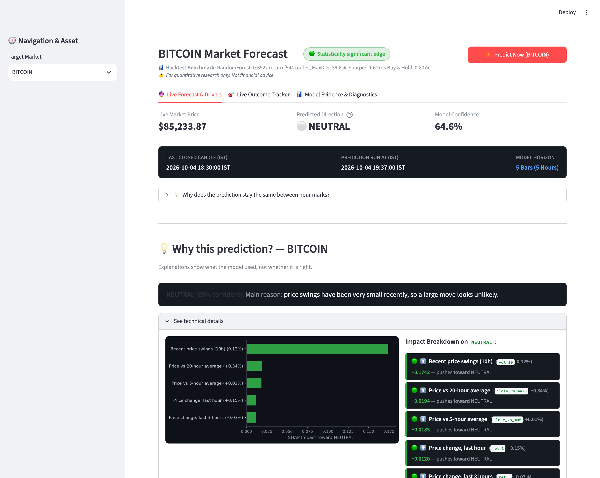
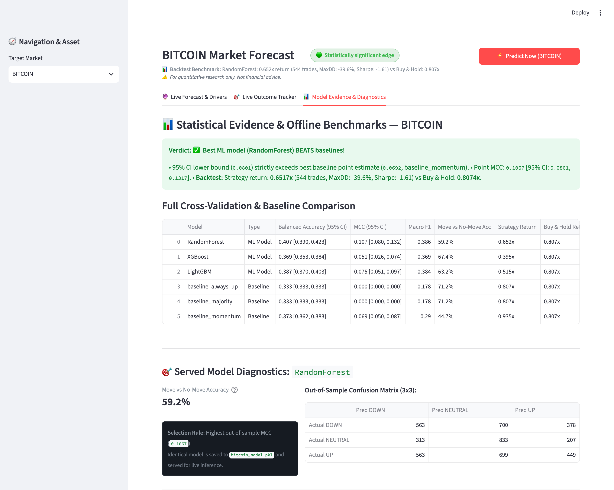
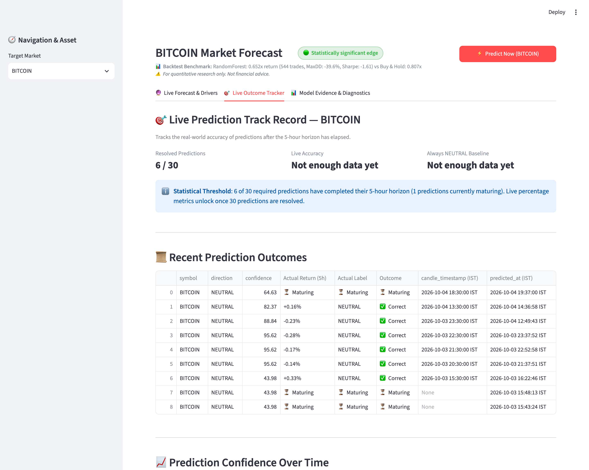
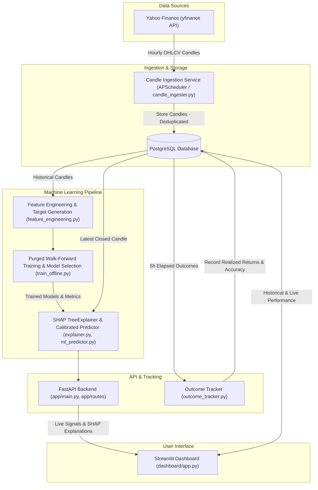

# MarketLens: Explainable Market Trend Forecasting with Live Performance Tracking

An end-to-end machine learning system that forecasts short-term market trends for crypto and equity assets using hourly price data. It serves calibrated predictions via a FastAPI backend, explains model decisions in plain English with SHAP values, and tracks real-world accuracy over time in an interactive Streamlit dashboard.

---

## What It Does

This platform continuously collects hourly market data for **Bitcoin (BITCOIN)**, **Ethereum (ETHEREUM)**, and **IBM (IBM)**. For each asset, it predicts one of three directional outcomes over the next 5 hours:
* **UP**: Maximum forward gain reaches at least +0.5% and dominates downward movement.
* **DOWN**: Maximum forward decline reaches at least -0.5% and dominates upward movement.
* **NEUTRAL**: Price movement stays within ±0.5% over the 5-hour window.

Along with each prediction, the system outputs a calibrated confidence score, translates feature contributions into plain-English reasoning (such as recent volatility or momentum), and systematically records and verifies every prediction against actual future market prices once the 5-hour window closes.

---

## Visual Previews







---

## Architecture

The system operates as a modular, containerized data and prediction pipeline:



---

## Tech Stack

Derived directly from [`requirements.txt`](requirements.txt) and [`Dockerfile`](Dockerfile):

* **Language & Runtime:** Python 3.11, Docker, Docker Compose
* **Backend API & Scheduling:** FastAPI (>=0.111.0), Uvicorn (>=0.29.0), APScheduler (>=3.10.4), Pydantic
* **Database & Storage:** PostgreSQL 15, psycopg2-binary (>=2.9.9)
* **Machine Learning & Analytics:** scikit-learn (>=1.4.0), XGBoost (>=2.0.0), LightGBM (>=4.3.0), SHAP (>=0.45.0), joblib (>=1.3.2), NumPy (>=1.26.0), pandas (>=2.2.0)
* **Interactive Frontend:** Streamlit (>=1.35.0), Matplotlib (>=3.8.0), Seaborn (>=0.13.0)
* **Market Data & Testing:** yfinance (>=0.2.40), requests (>=2.31.0), pytest (>=8.0.0)

---

## How to Run

### 1. Configure Environment Variables
Copy the example environment configuration and supply a database password:
```bash
cp .env.example .env
```
Edit `.env` to ensure `DB_PASSWORD` is configured.

### 2. Launch Services with Docker Compose
Start PostgreSQL, the FastAPI backend, and the Streamlit dashboard in detached mode:
```bash
docker compose up --build -d
```
Verify all three containers are healthy:
```bash
docker compose ps
```

### 3. Initialize Database Tables
Create database tables and required unique indexes:
```bash
docker compose exec api python scripts/init_db.py
```

### 4. Ingest Initial Data & Train Models (Optional)
To backfill candles and train the walk-forward models offline:
```bash
# Ingest historical candles
docker compose exec api python scripts/run_ingestion.py

# Train models using purged walk-forward cross-validation
docker compose exec api python ml/train_offline.py
```
*(Pre-trained models are already included in [`ml/models/`](ml/models/) so you can run predictions immediately.)*

### 5. Access Interfaces
* **Streamlit Dashboard:** [http://localhost:8501](http://localhost:8501)
* **FastAPI Swagger Documentation:** [http://localhost:8000/docs](http://localhost:8000/docs)
* **FastAPI Liveness Health Check:** [http://localhost:8000/health](http://localhost:8000/health)

---

## Results (Honest)

The metrics below are taken directly from [`ml/models/metrics.json`](ml/models/metrics.json) and [`ml/models/backtest.json`](ml/models/backtest.json), evaluated across 5 purged walk-forward folds spanning ~8 months of hourly data:

| Asset | Served Model | Model MCC (95% CI) | Best Baseline MCC (95% CI) | Strategy Return | Buy-and-Hold Return | Max Drawdown (Strategy vs B&H) | Trades |
| :--- | :--- | :--- | :--- | :--- | :--- | :--- | :--- |
| **BITCOIN** | RandomForest | **0.1067** [0.0801, 0.1317] | 0.0692 [0.0500, 0.0874] *(Momentum)* | +65.17% | **+80.74%** | -39.58% vs -53.72% | 544 |
| **ETHEREUM** | RandomForest | **0.0732** [0.0454, 0.1001] | 0.0517 [0.0328, 0.0697] *(Momentum)* | +34.60% | **+85.43%** | -73.85% vs -69.16% | 587 |
| **IBM** | RandomForest | **0.0419** [0.0094, 0.0743] | **0.0610** [0.0256, 0.0992] *(Majority)* | +60.08% | **+135.60%** | -45.20% vs -37.89% | 605 |

### Key Findings
1. **Statistically Significant Edge on Bitcoin:** The Bitcoin model exhibits a small, statistically valid classification edge over random chance and baselines ($MCC = 0.1067$, with the 95% bootstrap confidence interval strictly above baseline momentum).
2. **Inconclusive on Ethereum:** While Ethereum achieves an MCC of 0.0732, the confidence interval overlaps with baseline variation, indicating marginal predictive power.
3. **No Proven Edge on IBM:** The served model ($MCC = 0.0419$) is outperformed by a trivial majority-class baseline ($MCC = 0.0610$).
4. **Fees Erode Alpha:** In fee-aware backtesting (5 bps transaction fee + 5 bps slippage), **none of the active trading strategies beat passive buy-and-hold**. While the strategy reduces maximum drawdown on Bitcoin (-39.6% vs -53.7%), frequent trading churn drags total net returns below buy-and-hold.

---

## How It Is Evaluated

* **Purged Walk-Forward Validation:** Evaluated using 5 chronological expanding-window folds. An embargo buffer (`horizon = 5` bars) is purged between training and validation splits to prevent lookahead bias.
* **Block-Bootstrap Confidence Intervals:** 95% empirical confidence intervals for MCC and Balanced Accuracy are computed using moving block bootstrap (block size = 24 bars) to preserve serial autocorrelation.
* **Realistic Baselines:** Models are benchmarked against trivial baselines: `Always UP`, `Majority Class`, and a `10-hour Momentum Heuristic`.
* **Fee-Aware Backtesting:** Simulates a long/flat/short execution policy applying realistic transaction friction (0.05% exchange fee + 0.05% slippage per turn).
* **Live Outcome Tracking:** A background cron job periodically queries subsequent market prices once 5 hours elapse, recording true outcomes and tracking live prediction accuracy in PostgreSQL.

---

## Limitations

1. **Short Historical Sample:** Ingestion and training cover approximately 8 months of hourly data (~5,000 candles).
2. **Price-Only Features:** Features are derived solely from OHLCV candles (returns, rolling volatility, RSI, MACD, price-to-moving-average ratios). Order book depth, sentiment, funding rates, and macroeconomic indicators are not included.
3. **Model Selection Overlap:** The served model was selected on the same walk-forward validation splits it was evaluated on.
4. **Single Asset Edge:** Only Bitcoin demonstrates a statistically defensible classification edge over baselines.
5. **Live Sample Size:** Live outcome tracking metrics require multiple weeks of live operation before statistical significance can be established.
6. **Not Financial Advice:** This software is an engineering demonstration of predictive ML pipelines and is not intended for live capital allocation.

---

## Project Structure

```
├── Dockerfile                  # Multi-target build (FastAPI API and Streamlit Dashboard)
├── docker-compose.yml          # Container orchestration (postgres, api, dashboard)
├── requirements.txt            # Python dependencies
├── pytest.ini                  # Pytest configuration
├── schema.sql                  # PostgreSQL database DDL
├── .env.example                # Template for environment configuration
│
├── app/
│   ├── main.py                 # FastAPI application entrypoint & lifecycle
│   ├── config.py               # Settings and environment loader
│   ├── database.py             # PostgreSQL connection pooling
│   ├── scheduler.py            # APScheduler cron jobs (hourly ingestion & outcome tracker)
│   ├── routes/
│   │   ├── predict.py          # GET /api/predict/{symbol}
│   │   ├── explain.py          # GET /api/explain/{symbol}
│   │   ├── performance.py      # GET /api/performance/{symbol}
│   │   ├── market_routes.py    # GET /api/market/latest, /api/market/history
│   │   └── trend_routes.py     # GET /api/trends
│   └── services/
│       ├── ml_predictor.py     # Live feature extraction and model inference
│       ├── explainer.py        # SHAP calculation and natural language summary
│       ├── outcome_tracker.py  # Resolution and verification of matured predictions
│       ├── prediction_store.py # Deduplicated persistence of prediction records
│       └── candle_ingester.py  # Ingestion of hourly candles from yfinance
│
├── dashboard/
│   └── app.py                  # Streamlit dashboard (Signal, SHAP, Comparison, Live Audit)
│
├── ml/
│   ├── feature_engineering.py  # Feature calculation (zero-leakage) & target generation
│   ├── market_data_fetcher.py  # Yahoo Finance market data fetcher
│   ├── train_offline.py        # Purged walk-forward training, calibration, backtesting
│   ├── predict_live.py         # Standalone CLI prediction script
│   ├── visualize.py            # Model visualization utilities
│   └── models/                 # Saved models, calibrated classifiers, metrics.json, backtest.json
│
├── scripts/
│   ├── init_db.py              # Database schema initialization script
│   ├── run_ingestion.py        # Manual candle ingestion script
│   └── verify_pipeline.py      # Automated sanity check of the full pipeline
│
├── tests/
│   ├── test_feature_engineering.py # Validates zero future data leakage
│   ├── test_make_target.py         # Validates +/-0.5% ternary horizon labeling
│   ├── test_outcome_tracker.py     # Validates resolution correctness & record immutability
│   └── test_prediction_store.py    # Validates duplicate candle protection
│
└── docs/                       # Architectural diagrams and screenshot previews
```

---

## API Endpoints

The FastAPI server provides the following endpoints (prefixed with `/api`):

| Method | Endpoint | Description |
| :--- | :--- | :--- |
| `GET` | `/health` | Liveness health check for container orchestration |
| `GET` | `/api/predict/{symbol}` | Fetches latest closed candle, generates calibrated UP/DOWN/NEUTRAL signal |
| `GET` | `/api/explain/{symbol}` | Computes SHAP feature importance and plain-English summary |
| `GET` | `/api/performance/{symbol}` | Returns offline backtest metrics and live prediction audit statistics |
| `GET` | `/api/market/latest` | Returns most recent market data candle for an asset |
| `GET` | `/api/market/history` | Returns historical candles for charting and analysis |
| `GET` | `/api/trends` | Heuristic trend records |
| `GET` | `/docs` | Interactive Swagger UI documentation |

---

## Author

**Harsh Nyati**  
* GitHub: [@HarshNyati](https://github.com/HarshNyati)  
* Repository: [MarketLens-Explainable-Market-Trend-Forecasting-with-Live-Performance-Tracking](https://github.com/HarshNyati/MarketLens-Explainable-Market-Trend-Forecasting-with-Live-Performance-Tracking)